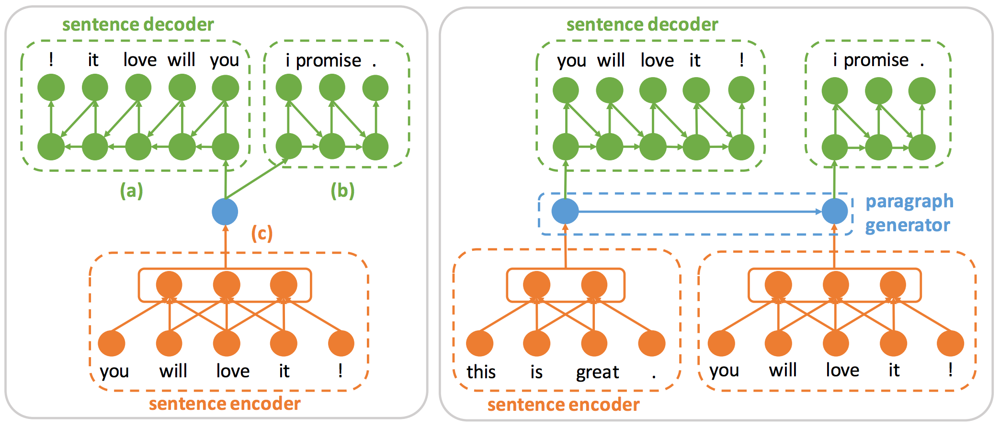

# ConvSent

The training code for the EMNLP 2017 paper “[Learning Generic Sentence Representations Using Convolutional Neural Networks](https://arxiv.org/pdf/1611.07897.pdf)”

Illustration of the CNN-LSTM encoder-decoder models.



## Dependencies

This code is written in python. To use it you will need:

* Python 2.7 (do not use Python 3.0)
* Theano 0.7 (you can also use the most recent version)
* A recent version of NumPy and SciPy 

## Getting started

Inside the ./data file, I provided a randomly sampled 1M sentences from the BookCorpus dataset for demo purposes. 

We provide the CNN-LSTM auto-encoder training code here. The training code for the future predictor and the composite model is similar to this. The training code for the hierarchical model can be also easily revised based on this code. 

1. Run `train_autoencoder.py` to start training. 
```
THEANO_FLAGS=mode=FAST_RUN,device=gpu,floatX=float32 python train_autoencoder.py 
```

2. After training, you can run `sentence_retrieval.py` and `vector_compositionality.py` to do the qualitative analysis experiments in the paper. 

```
you needed me ? - you got me ? + i got you . = i needed you .
```

## Citing ConvSent

Please cite our EMNLP paper in your publications if it helps your research:

    @inproceedings{ConvSent_EMNLP2017,
      Author = {Gan, Zhe and Pu, Yunchen and Ricardo, Henao and Li, Chunyuan and He, Xiaodong and Carin, Lawrence},
      Title = {Learning Generic Sentence Representations Using Convolutional Neural Networks},
      booktitle={EMNLP},
      Year  = {2017}
    }